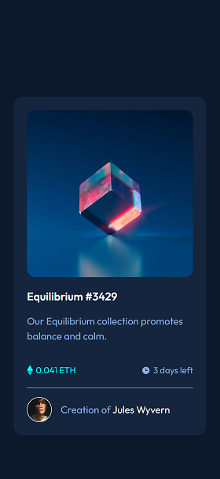
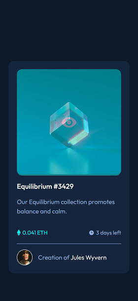

# Frontend Mentor - NFT preview card component solution

This is a solution to the [NFT preview card component challenge on Frontend Mentor](https://www.frontendmentor.io/challenges/nft-preview-card-component-SbdUL_w0U). Frontend Mentor challenges help you improve your coding skills by building realistic projects.

## Table of contents

- [Overview](#overview)
  - [The challenge](#the-challenge)
  - [Screenshot](#screenshot)
  - [Links](#links)
- [My process](#my-process)
  - [Built with](#built-with)
  - [What I learned](#what-i-learned)
  - [Continued development](#continued-development)
  - [Useful resources](#useful-resources)
- [Author](#author)
- [Acknowledgments](#acknowledgments)

## Overview

### The challenge

Users should be able to:

- View the optimal layout depending on their device's screen size
- See hover states for interactive elements

### Screenshot

### Links

- Live Site URL: [https://doublekari.github.io/frontendmentor-01-nft-preview-card-component-main/](https://doublekari.github.io/frontendmentor-01-nft-preview-card-component-main/)

## My process

### Built with

- Semantic HTML5 markup
- CSS custom properties
- Flexbox

### What I learned

1. How to fit an image into it's container.
2. How to really make use of flexbox.

### Continued development

I want to learn how to do overlays and also learn more responsive techniques.

### Useful resources

- [W3Schools](https://www.w3schools.com) - This website helped me fitting an image into it's container.
- [stackoverflow](https://stackoverflow.com) - They also helped me with fitting an image into it's container.

## Author

- Frontend Mentor - [@doubleKari](https://www.frontendmentor.io/profile/doubleKari)
- Twitter - [@stearyear](https://www.twitter.com/stealyear)

## Acknowledgments

Thanks to all web developers on Twitter who share such wonderful resources and also to frontend mentor for providing such challenging exercise to improve ones styling skills.
